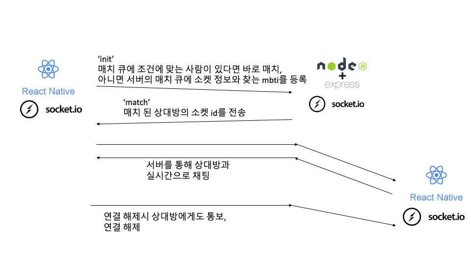

# mbtiChat - Backend
2021 Winter [CS496] KAIST 몰입캠프 Project #2

mbti 랜덤채팅 서비스를 위한 서버.

## 기술 스택 

Node.js + Express + socket.io + typescript + postgresql

- 카카오 REST API를 이용한 로그인

- 웹 소켓을 이용한 실시간 채팅 

## Login


## API
base url: <code>http://192.249.18.173:80</code>

### user 

#### /user/spinner

```
GET
```

kakao login redirect uri 

spinner가 있는 html파일을 반환함 

#### /user/oauth

```
GET
query: {code}  
```
카카오 로그인 인가코드를 받아서 토큰, 유저 정보를 반환함


#### /user/mbti

```
PUT
query: {id, mbti}
```
해당 id를 가진 유저의 mbti값을 변경

#### /user/nickname
```
PUT
query: {id, nick}
```
해당 id를 가진 유저의 nickname 값을 변경 

### friend

#### /friend/get
```
GET
query: {id}
```
해당 id를 가진 유저의 친구 리스트를 반환 

#### /friend/add

```
POST
body: {from, to}
```
새로운 친구를 추가

#### /friend/talk
```
GET
query: {from, to}
```
해당 유저가 상대 유저에게 보냈던 채팅 리스트를 반환

## socket event 



(단, 친구와의 메시지는 서버 DB에도 저장됨)

## DB table

``` SQL
CREATE TABLE users (
  id varchar(12),
  image_url varchar(100),
  thumbnail_url varchar(100),
  email varchar(50),
  age varchar(10),
  gender varchar(6),
  mbti varchar(4),
  nick varchar(20),
  primary key (id)
);

CREATE TABLE match_queue (
  id varchar(12),
  socketID varchar(50),
  finding integer,
  primary key (id),
  foreign key (id) references users
);

CREATE TABLE friend (
  add_from varchar(12),
  add_to   varchar(12),

  primary key (add_from, add_to),
  foreign key (add_from) references users,
  foreign key (add_to)   references users
);

CREATE TABLE TALK (
  send_from varchar(12),
  send_to varchar(12),
  talk_message varchar(500),
  send_at timestamp,

  primary key (send_from, send_to, send_at),
  foreign key (send_from) references users,
  foreign key (send_to)   references users
);
```